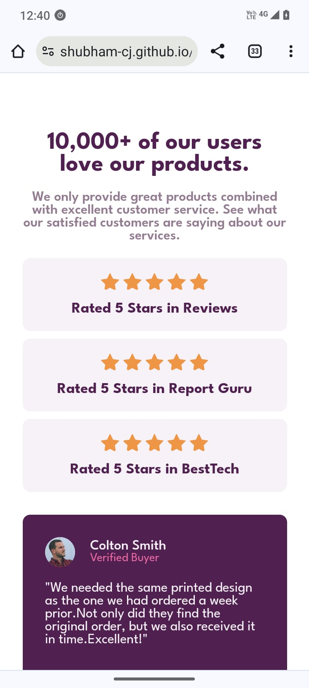

# Frontend Mentor - Social proof section solution

This is a solution to the [Social proof section challenge on Frontend Mentor](https://www.frontendmentor.io/challenges/social-proof-section-6e0qTv_bA). Frontend Mentor challenges help me improve my coding skills by building realistic projects. 

## Table of contents

- [Overview](#overview)
  - [The challenge](#the-challenge)
  - [Screenshot](#screenshot)
  - [Links](#links)
- [My process](#my-process)
  - [Built with](#built-with)
- [Author](#author)

## Overview

### The challenge

Users should be able to:

- View the optimal layout for the section depending on their device's screen size

### Screenshot
###### Desktop view 

###### Mobile view 

### Links

- Solution URL: [click here to see](https://your-solution-url.com)
- Live Site URL: [click here to see](https://shubham-cj.github.io/Social-proof-section-master/)

## My process

### Built with

- Semantic HTML5 markup
- CSS custom properties
- Flexbox
- CSS Grid
- Mobile-first workflow

## Author

- Website - [Shubham Jagtap](https://shubhamcj.ccbp.tech/)
- Frontend Mentor - [@shubham-cj](https://www.frontendmentor.io/profile/shubham-cj)
- Twitter - [@tw_shubhamCJ](https://www.twitter.com/tw_shubhamCJ)
